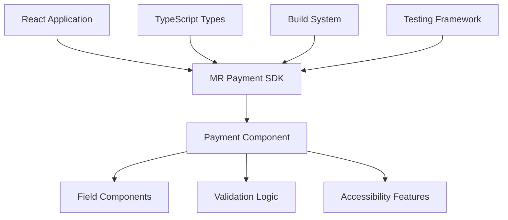
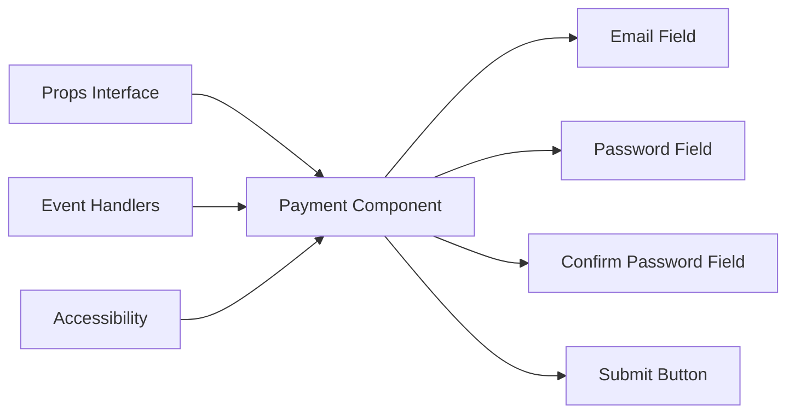
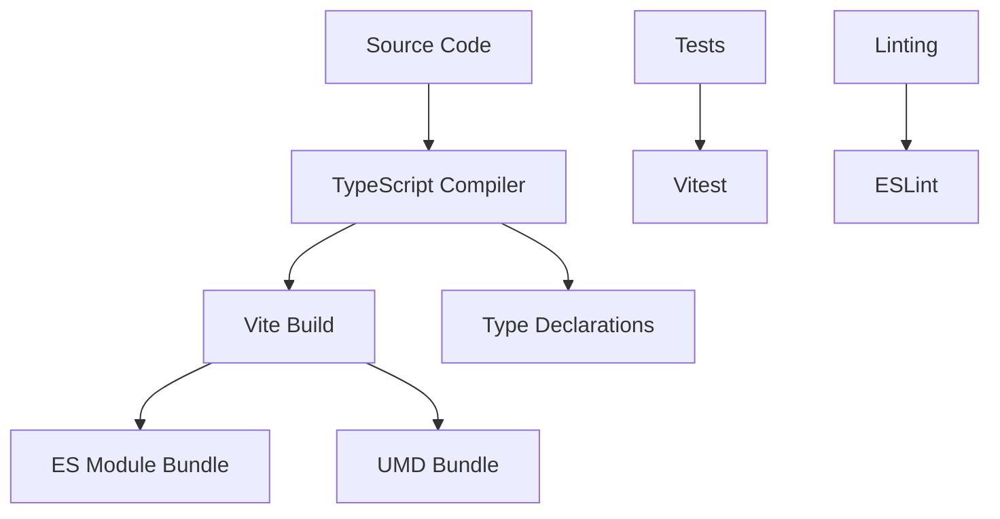
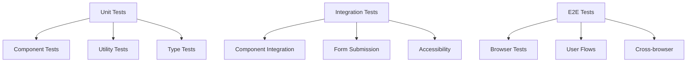

# Technical Product Requirements Document (PRD)

**Product**: MR Payment SDK  
**Version**: 1.0  
**Date**: January 2024  
**Status**: Approved  

## 📋 Technical Overview

### Architecture Philosophy
The MR Payment SDK follows a headless architecture pattern, providing unstyled, accessible React components that developers can fully customize. The architecture emphasizes performance, type safety, and developer experience.

### Core Principles
1. **Headless Design**: No built-in styling, complete customization control
2. **Type Safety**: Full TypeScript support with comprehensive type definitions
3. **Performance**: Lightweight, tree-shakeable, and optimized bundles
4. **Accessibility**: WCAG 2.1 AA compliance by default
5. **Developer Experience**: Excellent documentation and developer tools

## 🏗 Technical Architecture

### High-Level Architecture



### Component Architecture



### Build Architecture



## 🔧 Technical Stack

### Core Technologies

#### Frontend Framework
- **React**: 19.1.0+ (latest stable)
- **React DOM**: 19.1.0+ (latest stable)
- **JSX**: React JSX transformation

#### Language & Types
- **TypeScript**: 5.8.3+ (latest stable)
- **ES2022**: Modern JavaScript features
- **Strict Mode**: Full TypeScript strict mode

#### Build System
- **Vite**: 7.0.3+ (fast build tool)
- **Rollup**: Bundle optimization
- **SWC**: Fast JSX transformation

#### Testing
- **Vitest**: 3.2.4+ (fast test runner)
- **React Testing Library**: 14.2.1+ (component testing)
- **Playwright**: 1.53.2+ (browser testing)
- **jsdom**: 24.0.0+ (DOM environment)

#### Development Tools
- **ESLint**: 9.30.1+ (code linting)
- **TypeScript ESLint**: 8.35.1+ (TypeScript linting)
- **Prettier**: Code formatting (recommended)

### Package Management
- **pnpm**: Primary package manager
- **npm**: Alternative package manager
- **yarn**: Alternative package manager

## 📦 Package Structure

### Source Structure
```
src/
├── payment/
│   ├── payment.tsx          # Main payment component
│   └── payment.test.tsx     # Component tests
├── test/
│   └── setup.ts            # Test configuration
├── index.ts                # Main exports
├── App.tsx                 # Demo application
└── main.tsx               # Entry point
```

### Build Output
```
dist/
├── mrpayment-sdk.es.js          # ES module bundle
├── mrpayment-sdk.umd.js         # UMD bundle
├── mrpayment-sdk.d.ts           # Main type declarations
├── payment/
│   └── payment.d.ts             # Component types
└── types/                       # Detailed type declarations
    ├── index.d.ts
    ├── payment.d.ts
    └── *.d.ts.map               # Source maps
```

### Package.json Configuration
```json
{
  "name": "@mrpayment/sdk",
  "version": "0.0.1",
  "type": "module",
  "main": "dist/mrpayment-sdk.umd.js",
  "module": "dist/mrpayment-sdk.es.js",
  "types": "dist/mrpayment-sdk.d.ts",
  "exports": {
    ".": {
      "types": "./dist/mrpayment-sdk.d.ts",
      "import": "./dist/mrpayment-sdk.es.js",
      "require": "./dist/mrpayment-sdk.umd.js"
    }
  }
}
```

## 🔌 Component Specifications

### Payment Component

#### Interface Definition
```typescript
interface PaymentProps extends React.HTMLAttributes<HTMLFormElement> {
  container?: string;
  fields?: {
    email?: FieldConfig;
    password?: FieldConfig;
    confirmPassword?: FieldConfig;
  };
  submit?: SubmitConfig;
}

interface FieldConfig {
  container?: string;
  label?: {
    text?: string;
    styles?: string;
  };
  input?: {
    styles?: string;
  };
}

interface SubmitConfig {
  action?: () => void;
  text?: string;
  styles?: string;
}
```

#### Component Implementation
```typescript
const Payment = React.forwardRef<HTMLFormElement, PaymentProps>(
  (props, ref) => {
    const formId = useId();
    
    const handleSubmit = (e: React.FormEvent<HTMLFormElement>) => {
      e.preventDefault();
      props.submit?.action?.();
    };
    
    return (
      <form ref={ref} {...props} className={props.container} onSubmit={handleSubmit}>
        {/* Field implementations */}
      </form>
    );
  }
);
```

#### Accessibility Features
- **Unique IDs**: Generated using React's `useId()` hook
- **Label Associations**: Proper `htmlFor` and `id` attributes
- **Keyboard Navigation**: Full keyboard support
- **Screen Reader**: ARIA attributes and semantic HTML
- **Focus Management**: Proper focus handling

## 🏗 Build Configuration

### Vite Configuration
```typescript
export default defineConfig({
  plugins: [
    react(),
    dts({
      insertTypesEntry: true,
      root: "src",
      outDir: "dist",
    })
  ],
  build: {
    lib: {
      entry: path.resolve(__dirname, "src/index.ts"),
      name: "mrpayment-sdk",
      formats: ["es", "umd"],
      fileName: (format) => `mrpayment-sdk.${format}.js`,
    },
    rollupOptions: {
      external: ["react", "react-dom"],
      output: {
        globals: {
          react: "React",
          "react-dom": "ReactDOM",
        },
      },
    },
  },
});
```

### TypeScript Configuration
```json
{
  "compilerOptions": {
    "target": "ES2022",
    "lib": ["ES2022", "DOM", "DOM.Iterable"],
    "module": "ESNext",
    "moduleResolution": "bundler",
    "jsx": "react-jsx",
    "strict": true,
    "declaration": true,
    "declarationMap": true,
    "outDir": "./dist/types"
  }
}
```

### ESLint Configuration
```javascript
export default tseslint.config([
  globalIgnores(['dist']),
  {
    files: ['**/*.{ts,tsx}'],
    extends: [
      js.configs.recommended,
      tseslint.configs.recommended,
      reactHooks.configs['recommended-latest'],
      reactRefresh.configs.vite,
    ],
    languageOptions: {
      ecmaVersion: 2020,
      globals: globals.browser,
    },
  },
]);
```

## 🧪 Testing Strategy

### Test Architecture


### Test Configuration
```typescript
// vitest.config.ts
export default defineConfig({
  test: {
    environment: "jsdom",
    setupFiles: ["./src/test/setup.ts"],
    coverage: {
      provider: "v8",
      reporter: ["text", "json", "html"],
    },
  },
});
```

### Test Examples
```typescript
describe('Payment Component', () => {
  it('renders payment form with default fields', () => {
    render(<Payment />);
    expect(screen.getByLabelText('Email')).toBeInTheDocument();
  });

  it('calls submit action when form is submitted', () => {
    const mockSubmitAction = vi.fn();
    render(<Payment submit={{ action: mockSubmitAction }} />);
    
    const submitButton = screen.getByRole('button');
    fireEvent.click(submitButton);
    
    expect(mockSubmitAction).toHaveBeenCalled();
  });
});
```

## 📊 Performance Specifications

### Bundle Size Targets
- **ES Module**: <15KB gzipped
- **UMD Bundle**: <12KB gzipped
- **Type Declarations**: <5KB total

### Runtime Performance
- **Component Initialization**: <100ms
- **Form Rendering**: <50ms
- **Event Handling**: <10ms
- **Memory Usage**: <5MB additional

### Optimization Strategies
- **Tree Shaking**: ES modules for unused code elimination
- **Code Splitting**: Separate bundles for different features
- **Minification**: Production builds are minified
- **Source Maps**: Development builds include source maps

## 🔒 Security Specifications

### Security Principles
- **No Data Storage**: SDK doesn't store sensitive data
- **Input Validation**: Support for input validation
- **Secure by Default**: Follow security best practices
- **HTTPS Only**: Support for secure connections

### Security Measures
- **Type Safety**: TypeScript prevents type-related vulnerabilities
- **Input Sanitization**: Support for input sanitization
- **XSS Prevention**: React's built-in XSS protection
- **CSRF Protection**: Support for CSRF tokens

### Security Testing
- **Dependency Scanning**: Regular security audits
- **Vulnerability Testing**: Automated vulnerability scanning
- **Penetration Testing**: Regular security assessments
- **Code Review**: Security-focused code reviews

## 🌐 Browser Support

### Supported Browsers
- **Chrome**: 90+
- **Firefox**: 88+
- **Safari**: 14+
- **Edge**: 90+

### Feature Support
- **ES2022**: Modern JavaScript features
- **CSS Grid**: Modern CSS layout
- **Flexbox**: Modern CSS layout
- **Custom Properties**: CSS variables

### Polyfills
- **No Polyfills**: Modern browser features only
- **Graceful Degradation**: Fallbacks for older browsers
- **Feature Detection**: Runtime feature detection

## 🔧 Development Workflow

### Development Environment
```bash
# Install dependencies
pnpm install

# Start development server
pnpm dev

# Run tests
pnpm test

# Build for production
pnpm build

# Lint code
pnpm lint
```

### CI/CD Pipeline
```yaml
name: CI/CD Pipeline

on: [push, pull_request]

jobs:
  test:
    runs-on: ubuntu-latest
    steps:
      - uses: actions/checkout@v3
      - uses: actions/setup-node@v3
        with:
          node-version: '18'
          cache: 'pnpm'
      - run: pnpm install
      - run: pnpm test
      - run: pnpm build
      - run: pnpm lint
```

### Release Process
```bash
# Update version
pnpm version:patch

# Build and test
pnpm build
pnpm test

# Publish to NPM
pnpm publish:public
```

## 📈 Monitoring & Analytics

### Performance Monitoring
- **Bundle Size**: Track bundle size changes
- **Load Time**: Monitor component load times
- **Error Rates**: Track runtime errors
- **User Metrics**: Monitor usage patterns

### Quality Metrics
- **Test Coverage**: Maintain >90% coverage
- **Type Coverage**: 100% TypeScript coverage
- **Lint Score**: 0 linting errors
- **Build Success**: >99% build success rate

### User Analytics
- **Download Count**: NPM download statistics
- **GitHub Stars**: Repository popularity
- **Issue Resolution**: Time to resolve issues
- **Community Engagement**: Active contributors

## 🔄 Maintenance & Updates

### Dependency Management
- **Regular Updates**: Monthly dependency updates
- **Security Patches**: Immediate security updates
- **Breaking Changes**: Careful evaluation of breaking changes
- **Compatibility**: Maintain React compatibility

### Version Management
- **Semantic Versioning**: Follow semver guidelines
- **Changelog**: Maintain detailed changelog
- **Migration Guides**: Provide migration documentation
- **Deprecation Policy**: Clear deprecation timeline

### Support Policy
- **Critical Issues**: <24 hours response
- **Major Issues**: <72 hours response
- **Minor Issues**: <1 week response
- **Feature Requests**: Monthly review cycle

## 📚 Documentation Standards

### Code Documentation
- **JSDoc**: Comprehensive JSDoc comments
- **Type Definitions**: Detailed TypeScript types
- **Examples**: Working code examples
- **API Reference**: Complete API documentation

### Technical Documentation
- **Architecture**: System architecture documentation
- **Integration**: Integration guides
- **Troubleshooting**: Common issues and solutions
- **Performance**: Performance optimization guides

### User Documentation
- **Getting Started**: Quick start guides
- **Tutorials**: Step-by-step tutorials
- **Examples**: Real-world examples
- **Best Practices**: Development best practices

## ✅ Technical Approval

**Technical Lead**: [Name] - [Date]  
**Senior Developer**: [Name] - [Date]  
**DevOps Engineer**: [Name] - [Date]  
**Security Engineer**: [Name] - [Date]  

---

*This document is a living document and will be updated as technical requirements evolve.* 